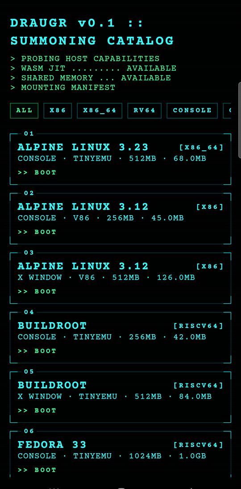
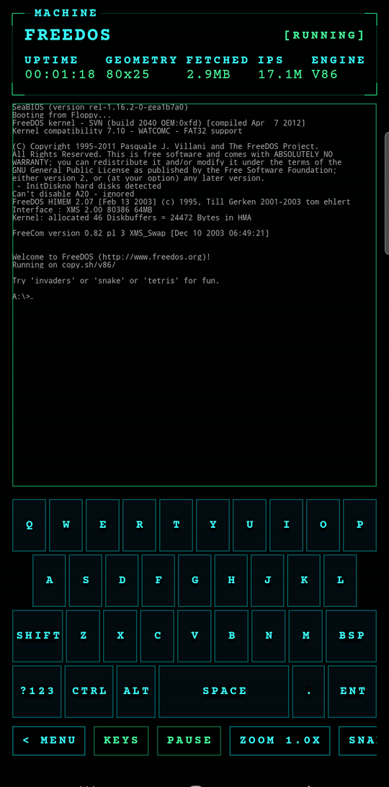
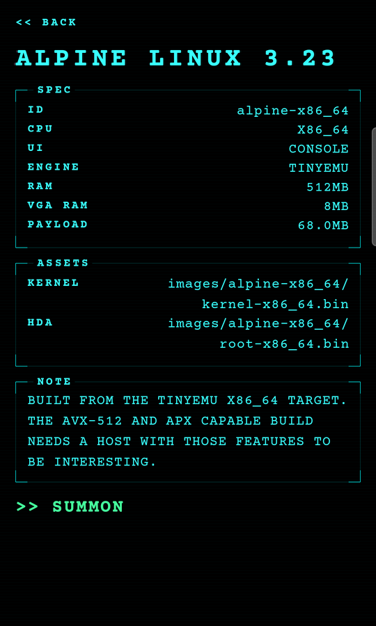
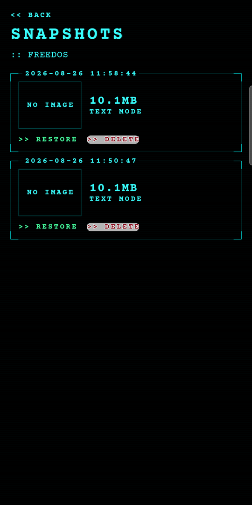
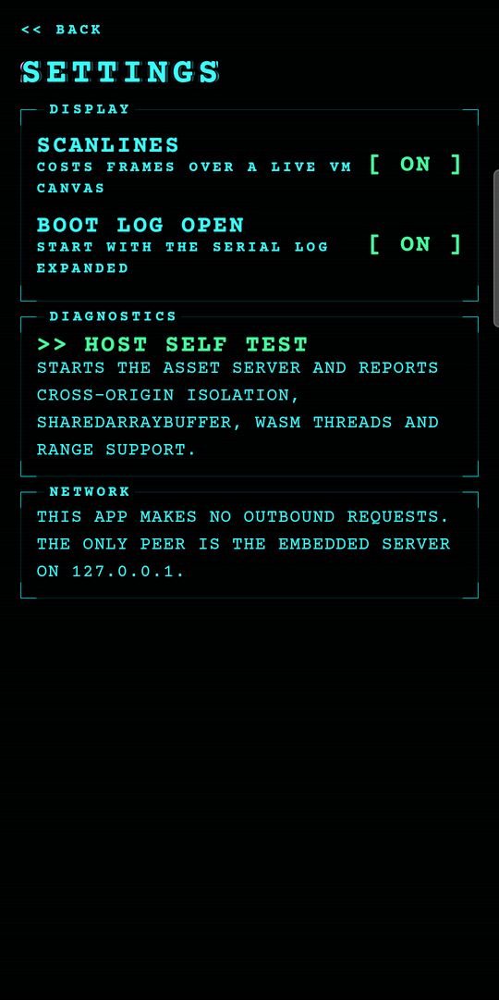
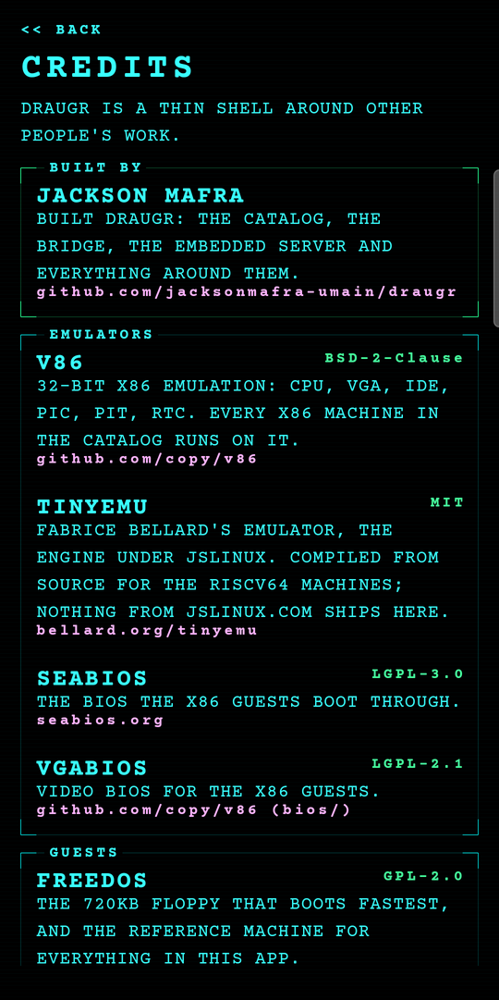
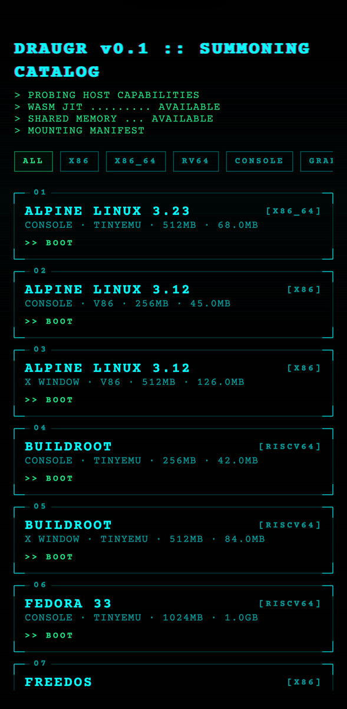
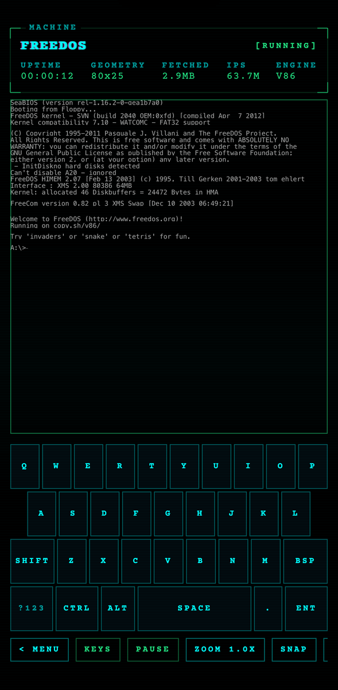

# draugr


> **draugr** (Old Norse): the undead that walk again from the howe. Dead operating systems,
> resurrected in your pocket.

A Compose Multiplatform app that boots emulated machines on-device. The catalog, HUD, keyboard
and boot log are shared Compose; the emulator is a WebAssembly payload running inside a platform
web view.

**Proof of concept. Local only. Not for store distribution.**

| Catalog | Machine | Detail | Snapshots | Settings | Credits |
|---|---|---|---|---|---|
|  |  |  |  |  |  |

Android above, a Galaxy A34 running FreeDOS through v86. The same build on iOS:

| Catalog | Machine |
|---|---|
|  |  |

Note the instruction rate in the two machine shots: **17.1M** on Android against **63.7M** on
iOS. That gap is the reason the whole architecture exists — see below.

## Why it is built this way

The app cannot emulate anything itself.

iOS forbids `fork`, `posix_spawn` and W→X `mprotect`, so a native emulator would be
interpreted-only and unusably slow. But **`WKWebView` runs out-of-process in WebContent, which
holds the `dynamic-codesigning` entitlement** — WebKit is allowed to JIT. WebAssembly inside a
web view therefore runs *compiled*, not interpreted. That single fact is why the project is
viable on iOS at all. Android's Chromium `WebView` gives the equivalent.

So: **the emulator is a WASM payload, the web view is the CPU host, and Compose is the console.**

```
┌──────────────────────── Compose Multiplatform (commonMain) ─────────────────────────┐
│  CatalogScreen · MachineDetailScreen · VmScreen · SnapshotScreen · SettingsScreen   │
│  BracketPanel · GlitchText · ScanlineOverlay · TerminalKeyboard · StatBar           │
│                                                                                     │
│  VmController ── VmState/VmEvent ── BridgeProtocol ── Scancodes ── CatalogRepository │
└───────────┬─────────────────────────────────────────────────────┬───────────────────┘
            │ expect/actual                                       │ expect/actual
   ┌────────┴────────┐                                   ┌────────┴─────────┐
   │  AssetServer    │  Ktor CIO on 127.0.0.1            │  VmBridge        │
   │  ephemeral port │  COOP/COEP/CORP · Range · token   │  VmSurface       │
   └────────┬────────┘                                   └────────┬─────────┘
            │ http://127.0.0.1:PORT/TOKEN/…                       │ JS ⇄ Kotlin
            ▼                                                     ▼
   ┌─────────────────────────────────────────────────────────────────────────┐
   │  host.html + bridge.js        window.DRAUGR (one contract, two engines) │
   │      ├── v86            libv86.js + v86.wasm      (vendored, pinned)    │
   │      └── tinyemu-shim   tinyemu64.js/.wasm        (built locally)       │
   └─────────────────────────────────────────────────────────────────────────┘
```

## Using it

Tap a catalog row to inspect a machine, `>> BOOT` to start it. Inside a machine:

| Control | Does |
|---|---|
| `< MENU` | back to the catalog with the guest **still running** |
| `KEYS` | show or hide the keyboard |
| `PAUSE` | stop and resume the guest |
| `ZOOM 1.0X` | cycle the terminal scale: 1.0 fits all 80 columns, larger grows the glyphs and pans |
| `SNAP` / `STATES` | take a snapshot, or open the saved-state list |
| `RESET` | boot the machine again |
| `HALT` | stop the machine for good |

A machine left running shows in the catalog as `RUNNING`, with `>> RESUME` instead of `>> BOOT`.
Android's back button follows the same rule: it navigates, and only leaves the app from the
catalog.

The keyboard is the app's own, because the system IME is unusable over a web view canvas on iOS.
It emits scancodes, never text. Letters, `SHIFT` and `BSP` sit on the first layer; `?123` reveals
numbers, symbols, arrows and `F1`–`F12`. `CTRL` and `ALT` latch, since a terminal needs them held
across keys; `SHIFT` releases after one character, the way a phone's does.

Tapping the catalog header opens settings, which is also where `HOST SELF TEST` and `CREDITS`
live. The credits screen names every emulator, guest and library the app is built on, with its
licence and where it came from — it is the same data a test asserts is complete.

### The mark

The icon is the Old Norse rune **dagaz**, two triangles meeting, inside the bracket corners the
app draws everywhere, with the chromatic offset `GlitchText` uses. It is generated rather than
drawn by hand, so every size stays identical:

```bash
python3 tools/generate-icons.py
```

That writes the Android launcher icons and adaptive layers, the iOS app icon and launch image at
all three scales, and `docs/icon.png`. The same rune is the splash on both platforms: Android
through `core-splashscreen` with a vector drawable, iOS through `UILaunchScreen`.

## The embedded server, and why `file://` cannot work

`AssetServer` runs Ktor CIO on `127.0.0.1` with an ephemeral port, mounted under a random
16-byte token so nothing else on the loopback interface can enumerate it. Three reasons it
cannot be replaced with `file://`:

1. `SharedArrayBuffer` requires cross-origin isolation — `COOP: same-origin` plus
   `COEP: require-corp`. A `file://` origin is never cross-origin isolated.
2. `WKWebView` blocks XHR and `fetch` from `file://` origins outright.
3. Disk images need HTTP **Range** so the guest streams 512-byte blocks on demand. On iOS this
   is not an optimisation: without it WebContent is jetsam-killed before boot completes.

Every response carries the three isolation headers plus `Accept-Ranges: bytes`. Range handling
is written out rather than delegated: single `bytes=` spans, open-ended and suffix forms, `206`
with a correct `Content-Range`, `416` with `bytes */size` when unsatisfiable.

### Speed

WebKit JITs WebAssembly, and it shows. FreeDOS on the same build and the same guest image:

| Host | Instructions per second |
|---|---|
| iPhone 15 simulator, iOS 17 | 63–65M |
| Pixel 6 Pro emulator, API 36 | 12–51M, depending on host load |
| Galaxy A34, Android 16 | 16–17M |

`FETCHED` beside it in the HUD is the bytes actually pulled over the loopback server, counted in
the page so it stays honest whichever engine is running.

### Cross-origin isolation in practice

| Host | `crossOriginIsolated` | `SharedArrayBuffer` | Threaded WASM |
|---|---|---|---|
| iOS `WKWebView` | **true** | yes | yes |
| Android `WebView` (Chromium 151) | **false** | no | no |

Android is not at parity here, and it is not a configuration mistake. The headers arrive intact
and the page is a secure context on `http://127.0.0.1`; `crossOriginIsolated` still reports
`false`, and no Chromium switch tried (`--enable-blink-features=SharedArrayBuffer`,
`--enable-features=SharedArrayBuffer`, `--site-per-process`) changes it. **Consequence: the
default TinyEMU build is single-threaded** (`ASYNCIFY`, no `-pthread`). v86 is single-threaded
anyway and runs identically on both platforms.

Check any host for yourself: tap the catalog header, then `HOST SELF TEST`.

## Machines

Ten entries in `catalog.json`. Bundled images are fetched at build time by
`emulator/fetch-images.sh` against pinned SHA-256 sums; the app itself never fetches anything.

| Machine | CPU | UI | Engine | RAM | Bundled | Licence |
|---|---|---|---|---|---|---|
| Alpine Linux 3.23 | x86_64 | Console | TinyEMU | 512MB | yes | Alpine: MIT/GPL, per-package |
| Alpine Linux 3.12 | x86 | Console | v86 | 256MB | yes | Alpine: MIT/GPL, per-package |
| Alpine Linux 3.12 | x86 | X Window | v86 | 512MB | yes | Alpine: MIT/GPL, per-package |
| Buildroot | riscv64 | Console | TinyEMU | 256MB | yes | GPL-2.0 kernel + BusyBox |
| Buildroot | riscv64 | X Window | TinyEMU | 512MB | yes | GPL-2.0 kernel + BusyBox |
| Fedora 33 | riscv64 | Console | TinyEMU | 1024MB | yes | Fedora: MIT/GPL, per-package |
| FreeDOS | x86 | VGA text | v86 | 64MB | yes | GPL-2.0 |
| ReactOS | x86 | Graphical | v86 | 512MB | yes | GPL-2.0 |
| Windows 95 | x86 | Graphical | v86 | 64MB | **no** | Proprietary — sideload only |
| Windows 2000 | x86 | Graphical | v86 | 512MB | **no** | Proprietary — sideload only |

Emulator payload: **v86** is BSD-2-Clause, **SeaBIOS** and **VGABIOS** are LGPLv3, **TinyEMU**
is MIT, **Courier Prime** is SIL OFL. Licence texts are in `third_party/`.

**No Microsoft-derived image is in this repository, and none ever will be.** The two Windows
entries are `bundled = false`, render dimmed as `[SIDELOAD REQUIRED]`, and take a user-supplied
image through the sideload path. Drop one in over iTunes File Sharing or pick it with the
document picker, and the catalog row becomes bootable.

## Networking: none

The app makes **no outbound network requests**. The only peer is the embedded server on
`127.0.0.1`. Android declares `android.permission.INTERNET` because binding a loopback socket
requires it, and its network security config permits cleartext to `127.0.0.1` and `localhost`
only. iOS declares `NSAllowsLocalNetworking` and nothing else. It runs airplane-mode clean.

Development-time scripts (`emulator/vendor.sh`, `emulator/fetch-images.sh`,
`emulator/build-tinyemu.sh`) do use the network. The app does not.

## Building

```bash
./gradlew :composeApp:assembleDebug          # Android APK
./gradlew :composeApp:testDebugUnitTest      # unit tests
./emulator/fetch-images.sh                   # guest images (pinned, git-ignored)
open iosApp/iosApp.xcodeproj                 # iOS, or:
xcodebuild -project iosApp/iosApp.xcodeproj -scheme iosApp -sdk iphonesimulator build
```

### Running on a physical iPhone

```bash
./iosApp/run-device.sh                 # first available paired device
./iosApp/run-device.sh "Qa iPhone 13"  # by name fragment
```

Signing is the only hard part, and it is invisible until the first device build. Simulator builds
need no team at all, so an empty `TEAM_ID` in `iosApp/Configuration/Config.xcconfig` goes
unnoticed and then fails with `No Account for Team`. The team has to be one **Xcode has an
account for** — a certificate sitting in the keychain is not enough. Check with:

```bash
security find-identity -v -p codesigning              # certificates present
defaults read com.apple.dt.Xcode IDEProvisioningTeams  # accounts Xcode is signed into
```

`TEAM_ID` is set to a free personal team, which is fine for a local proof of concept: the app
stops launching after seven days, and re-running the script signs it again. Override per machine
with `xcodebuild ... DEVELOPMENT_TEAM=YOURTEAM`.

The device must be unlocked, trusted, and have Developer Mode on
(Settings → Privacy & Security → Developer Mode). `xcrun devicectl list devices` is the source of
truth: a device shown as `unavailable` is paired but unreachable, which is what a dropped
wireless pairing looks like. Note that the older `xcrun xctrace list devices` reports wirelessly
paired devices under **Devices Offline** even when they are reachable, so trust `devicectl`.

Toolchain: Gradle 9.7.1, Kotlin 2.4.10, Compose Multiplatform 1.12.0, AGP 9.3.2, JDK 17+,
compileSdk 37, minSdk 26. Compose Multiplatform 1.12 no longer publishes `iosX64`, so the Intel
simulator is out; device and Apple Silicon simulator only.

Engine B has to be compiled locally — see `emulator/BUILDING.md`. Until it is, TinyEMU machines
boot to `engine not built: run emulator/build-tinyemu.sh` rather than failing quietly.

## Jetsam: the number one failure mode on iOS

WebContent is a separate process and iOS kills it aggressively under memory pressure, especially
while backgrounded. What the app does about it:

- **Auto-snapshot on `UIApplicationWillResignActive`**, persisted to disk, resumed on return.
- **`webViewWebContentProcessDidTerminate`** becomes `Suspended(HOST_TERMINATED)` and the screen
  offers a restore instead of the app dying with the page.
- **`memMb` is clamped to 512 on iOS.** Asking for more does not degrade gracefully; the whole
  web content process is killed mid-boot. The detail screen warns for machines above the budget.

### Troubleshooting

| Symptom | Cause | What to do |
|---|---|---|
| Guest dies silently on iOS, app survives | jetsam killed WebContent | Restore from the offered snapshot; pick a machine with less RAM |
| `Fedora 33` never finishes booting on device | 1024MB, above the iOS budget | Use it on Android, or on a simulator with room |
| `crossOriginIsolated = false` in the self test | Android WebView | Expected. Use single-threaded engine builds |
| Boot log silent, screen black | image missing or a 404 | Run `emulator/fetch-images.sh`; check the log for the failing URL |
| `SocketException: Operation not permitted` | `INTERNET` permission missing | Already declared; check a stripped manifest in a fork |
| Guest text clipped after rotation | the page refits through a `ResizeObserver` | If it persists, rotate again or reopen the machine |
| Guest text too small to read | 80 columns fitted to a phone's width | `ZOOM` cycles up to 3x and pans; landscape also helps |
| Device build fails with `No Account for Team` | `TEAM_ID` names a team Xcode has no account for | See *Running on a physical iPhone* |
| `xcrun xctrace` lists a connected iPhone as offline | it reports wireless pairings that way | Trust `xcrun devicectl list devices` |

## Layout

```
composeApp/src/commonMain/kotlin/com/umain/draugr/
├── catalog/    MachineSpec, CatalogRepository, filters, sideload merging
├── vm/         VmController, VmState/VmEvent, VmBridge (expect), BridgeProtocol, TinyEmuConfig
├── server/     AssetServer (expect), routing, Range handling, asset providers
├── storage/    SnapshotStore, SideloadStore, SettingsStore, image picker (expect), roots (expect)
├── input/      PC scancodes, Linux keycodes, the two keyboard layers
├── platform/   HostLifecycle (expect), BackGuard (expect), platform memory ceiling
└── ui/         theme, components, screens
composeApp/src/androidMain/   WebView + @JavascriptInterface, activity lifecycle, SAF picker
composeApp/src/iosMain/       WKWebView + WKScriptMessageHandler, notification lifecycle, document picker
emulator/                     vendor and build scripts, BUILDING.md, checksums
iosApp/                       Xcode project and run-device.sh
docs/screenshots/             the images above
```
